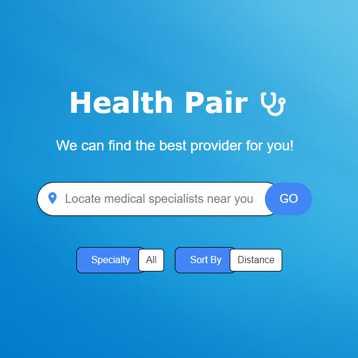

  

# Health Pair

This repository contains a medical services lookup and scheduling PWA including geolocation, insurance, and provider features.

## Project Overview

Built using the most modern technologies for front-end, back-end, database, containerization, and full DevOps integration.

## Installation and Setup
<ul>
    <li><code>Angular</code></li>
    <li><code>ASP API</code></li>
    <li><code>PostgreSQL</code></li>
    <li><code>Docker</code></li>
    <li><code>Kubernetes</code></li>
    <li><code>AWS Hosting</code></li>
    <li><code>Azure Hosting</code></li>
    <li><code>GitHub Webooks</code></li>
    <li><code>Azure Pipelines</code></li>
    <li><code>SonarCloud</code></li>
</ul>
